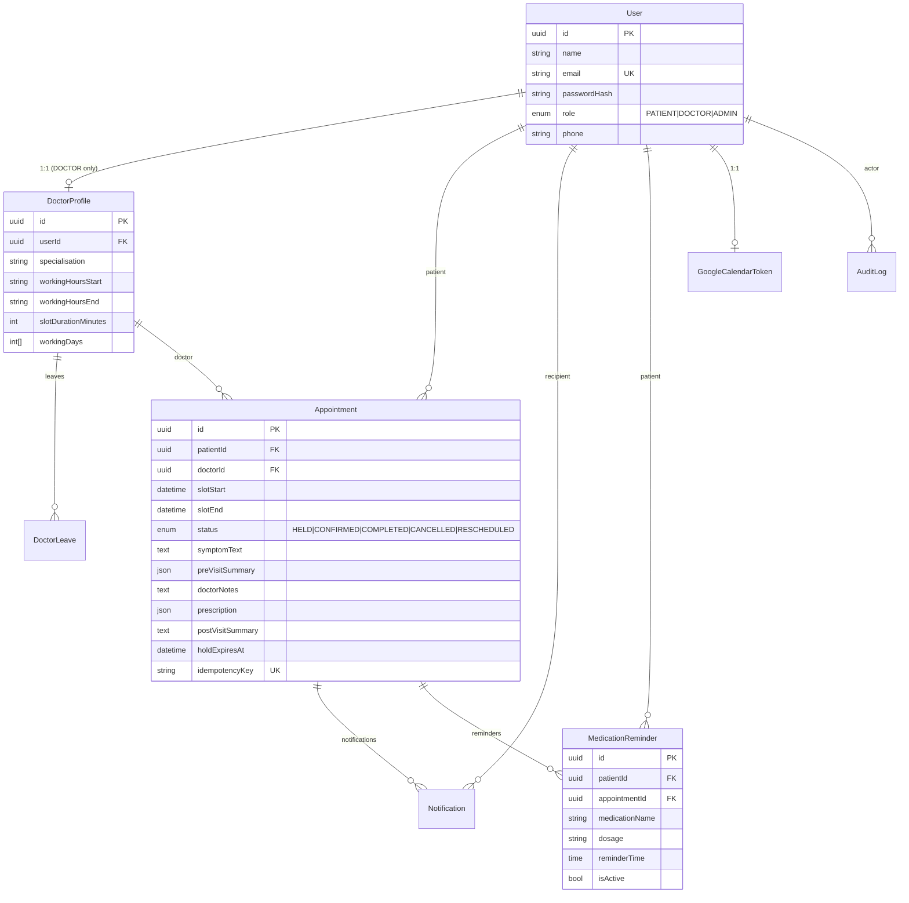

# 🏥 HealthCare Appointment & Follow-up Manager

> **Full-stack production-grade healthcare scheduling platform** built with Node.js, React, PostgreSQL, Redis, and Google Gemini AI. Designed and developed as a placement project demonstrating real-world backend architecture, queue-driven asynchronous workflows, AI integration, and modern UI/UX engineering.

---

## 🌐 Live Demo

🔗 **[https://hospital-management-pratyush-jaiswals-projects.vercel.app](https://hospital-management-pratyush-jaiswals-projects.vercel.app)**

### 🔑 Demo Credentials

| Role | Email | Password |
|---|---|---|
| 🔑 Admin | `admin@healthcare.local` | `Admin@1234` |
| 🩺 Doctor (Cardiology) | `dr.sharma@healthcare.local` | `Doctor@1234` |
| 🩺 Doctor (General Medicine) | `dr.mehta@healthcare.local` | `Doctor@1234` |
| 🧑 Patient | `patient@healthcare.local` | `Patient@1234` |

### 🚀 Deployment Stack

| Service | Platform | Free Tier |
|---|---|---|
| Frontend | Vercel | ✅ Free |
| Backend API | Railway | ✅ Free ($5/mo credit) |
| BullMQ Worker | Railway | ✅ Free |
| PostgreSQL | Neon | ✅ Free |
| Redis | Upstash | ✅ Free |

---

## 📋 Table of Contents

1. [Live Demo](#-live-demo)
2. [Project Overview](#project-overview)
3. [Key Features](#key-features)
4. [Tech Stack](#tech-stack)
5. [System Architecture](#system-architecture)
6. [Database Schema](#database-schema)
7. [Security Design](#security-design)
8. [AI Integration](#ai-integration)
9. [API Reference](#api-reference)
10. [Getting Started](#getting-started)
11. [Seed Credentials](#seed-credentials)
12. [Google Calendar Setup](#google-calendar-setup)
13. [Project Structure](#project-structure)
14. [Engineering Highlights](#engineering-highlights)
15. [Known Limitations & Future Work](#known-limitations--future-work)

---

## 📖 Project Overview

The **HealthCare Appointment & Follow-up Manager** is a full-stack web application that digitizes and streamlines the patient-doctor appointment lifecycle — from booking and scheduling to AI-generated pre/post-visit summaries, medication reminders, and calendar synchronization.

The project was built to simulate a real production healthcare scheduling system, incorporating industry-standard patterns such as transactional double-booking prevention, JWT-based authentication, background job processing, and graceful AI fallbacks.

### 🎯 Problem Being Solved

Healthcare scheduling in many clinics is still paper-based or fragmented across spreadsheets and phone calls. This platform provides:
- **Patients** — instant doctor discovery, self-service booking, appointment history, AI-powered visit summaries, and medication reminder management.
- **Doctors** — a daily schedule view, clinical note-taking with structured prescriptions, and AI-assisted patient-friendly summary generation.
- **Admins** — full doctor profile management, leave scheduling with automatic cascading cancellation, and notification audit trails.

---

## 🌟 Key Features

### 👤 Patient Portal
- **Doctor Discovery** — Search by specialisation with real-time availability computation
- **Slot Booking with Hold** — 5-minute slot hold prevents double-booking races, followed by confirmation with symptom submission
- **AI Pre-Visit Summary** — Google Gemini analyses symptoms and returns urgency level, chief complaint, and suggested doctor questions
- **AI Post-Visit Summary** — Doctor notes and prescription are rewritten into plain-language patient summaries
- **Appointment Management** — View, cancel, and reschedule confirmed appointments with filter tabs (Upcoming / Completed / Cancelled)
- **Medication Reminders** — Set daily reminders with dosage information; delivered via email
- **Google Calendar Sync** — Connect Google Calendar to auto-create/update/delete appointment events

### 🩺 Doctor Portal
- **Daily Schedule View** — Chronologically sorted list of confirmed appointments for today
- **Clinical Note Submission** — Structured notes with prescription (drug, dose, frequency, duration)
- **Appointment History** — Access full appointment records including AI summaries

### 🔑 Admin Panel
- **Doctor CRUD** — Create, read, update, and manage doctor profiles with working hours and specialisations
- **Leave Management** — Add/remove leave days; system automatically cancels and notifies affected patients
- **Notification Audit** — View failed notification jobs for operational visibility

### ⚙️ Cross-Cutting Capabilities
- **Dark / Light Theme Toggle** — System-wide theme persisted in local storage
- **Rate Limiting** — Configurable per-route middleware (15 req/min on auth, 200 req/15 min on API)
- **Background Job Processing** — BullMQ queues with retry logic for email, reminders, AI, and hold expiry
- **Premium UI** — Airbnb-inspired design system with Rausch Red (#ff385c) primary palette, matte black dark mode, specialty color-coded badges, skeleton loaders, and empty states

---

## 🛠️ Tech Stack

| Layer | Technology | Purpose |
|---|---|---|
| **Frontend** | React 18 + Vite + TypeScript | SPA with fast HMR dev server |
| **Styling** | Tailwind CSS + Custom CSS Variables | Airbnb-inspired design system with dark/light theming |
| **Backend** | Node.js + Express + TypeScript | RESTful API server |
| **ORM** | Prisma 5 | Type-safe database access with migration management |
| **Database** | PostgreSQL 15 | Relational data with SERIALIZABLE transaction support |
| **Queue / Jobs** | BullMQ + Redis 7 | Async background job processing with retries |
| **Authentication** | JWT (access + refresh) + bcrypt | Stateless auth with secure password hashing |
| **AI / LLM** | Google Gemini 1.5 Flash | Clinical summaries (free tier, graceful fallback) |
| **Email** | Nodemailer + Gmail SMTP | Transactional emails with preview via Ethereal in dev |
| **Calendar** | Google Calendar API (OAuth2) | Bidirectional calendar event management |
| **Containerisation** | Docker + Docker Compose | One-command PostgreSQL + Redis startup |
| **Validation** | Zod | Runtime schema validation on all API inputs |

---

## 🏗️ System Architecture

```
+--------------------------------------------------------+
|            React SPA (Vite + TypeScript)               |
|   Patient Portal | Doctor Portal | Admin Panel         |
+------------------------+-------------------------------+
                         |  HTTP/JSON  (CORS-guarded)
+------------------------v-------------------------------+
|              Express API  (Node.js + TypeScript)       |
|                                                        |
|  +----------+ +------------+ +--------+ +----------+  |
|  |   Auth   | |Appointments| |Doctors | |  Admin   |  |
|  |JWT+bcrypt| |Hold/Confirm| |Slots   | | CRUD     |  |
|  +----------+ +------------+ +--------+ +----------+  |
|                                                        |
|  +--------------+  +--------------+  +-------------+  |
|  |  LLM Service |  | Email Service|  | Calendar    |  |
|  | Gemini 1.5   |  | Nodemailer   |  | Google API  |  |
|  +--------------+  +--------------+  +-------------+  |
|                                                        |
|  +------------------- Rate Limiter -----------------+  |
|  |  Auth: 15 req/min  |  API: 200 req/15min         |  |
|  +---------------------------------------------------+  |
+------------+-------------------+----------------------+
             |                   |
    +--------v------+   +--------v---------------------+
    |  PostgreSQL   |   |    Redis  +  BullMQ Workers   |
    |  (Prisma ORM) |   |                              |
    |               |   |  +- hold-expiry  (slot TTL)  |
    |  SERIALIZABLE |   |  +- email        (send+retry)|
    |  transactions |   |  +- appt-reminder(24h before)|
    |  + row locks  |   |  +- med-reminder (daily)     |
    |  + unique idx |   |  +- llm-retry   (AI retry)  |
    +---------------+   +------------------------------+
```

---

## 🗄️ Database Schema



---

## 🛡️ Security Design

### Authentication
- **JWT access tokens** (short-lived) + **refresh tokens** (rotated on use)
- Passwords hashed with **bcrypt** (12 salt rounds)
- Role-based access control enforced at middleware level (`PATIENT`, `DOCTOR`, `ADMIN`)

### Double-Booking Prevention (5 Layers)

The system guarantees that no two patients can book the same doctor slot simultaneously, even under high concurrency:

| Layer | Mechanism | Description |
|---|---|---|
| 1 | **Partial Unique Index** | DB-level constraint: `(doctorId, slotStart) WHERE status IN ('HELD','CONFIRMED')` |
| 2 | **`SELECT FOR UPDATE`** | Row lock serializes concurrent hold requests for the same slot |
| 3 | **SERIALIZABLE Transaction** | Prevents phantom reads during slot hold creation |
| 4 | **Idempotency Key** | Duplicate network retries return the existing appointment instead of creating a new one |
| 5 | **Frontend 409 Handling** | Slot grid auto-refreshes on conflict; patient sees updated availability without a generic error |

### Rate Limiting
- Custom in-memory rate limiter middleware (zero external dependencies)
- `/auth/*` — **15 requests/minute** (brute-force and credential stuffing protection)
- All other API routes — **200 requests/15 minutes** (DoS mitigation)
- Returns `429 Too Many Requests` with standard `X-RateLimit-Limit`, `X-RateLimit-Remaining`, `X-RateLimit-Reset` headers

---

## 🤖 AI Integration

### Google Gemini 2.5 Flash (Free Tier)

Two AI-powered features are integrated, both with resilient fallbacks so that **booking never fails due to AI unavailability**.

#### Pre-Visit Summary
Triggered when a patient confirms a booking and submits symptoms.

```
System: You are a clinical intake assistant. Given a patient's free-text symptoms,
return ONLY valid JSON with keys:
  "urgencyLevel"        - one of "Low", "Medium", "High"
  "chiefComplaint"      - string, <=15 words
  "suggestedQuestions"  - array of exactly 3 strings (questions the doctor could ask)
Do not include any text outside the JSON object.
```

**Fallback**: `{ urgencyLevel: "Unknown", chiefComplaint: symptomText.slice(0,100), suggestedQuestions: [], generationFailed: true }`

#### Post-Visit Summary
Triggered when a doctor submits clinical notes and prescription.

```
System: You are a patient-communication assistant. Rewrite clinical notes into a warm,
plain-language summary a non-medical patient can understand. Include a clear medication
schedule (drug, dose, when to take it) and follow-up steps as a short bulleted list.
Do not add any medical advice not present in the notes.
```

**Fallback**: A structured summary is generated directly from the `prescription` JSON without calling the LLM.

---

## 🔌 API Reference

### Auth

| Method | Path | Auth | Description |
|---|---|---|---|
| `POST` | `/auth/register` | Public | Register a new patient account |
| `POST` | `/auth/login` | Public | Login — returns access + refresh tokens |
| `POST` | `/auth/refresh` | Public | Rotate access token using refresh token |
| `GET` | `/auth/me` | Any | Returns current authenticated user |
| `GET` | `/auth/google` | Any | Initiate Google OAuth for Calendar connection |
| `GET` | `/auth/google/callback` | — | OAuth2 callback; saves encrypted tokens |

### Doctors (Public)

| Method | Path | Auth | Description |
|---|---|---|---|
| `GET` | `/doctors` | Public | Search doctors (filter by specialisation) |
| `GET` | `/doctors/:id` | Public | Get doctor profile |
| `GET` | `/doctors/:id/availability?date=YYYY-MM-DD` | Public | Compute free slots for a given date |

### Appointments

| Method | Path | Auth | Description |
|---|---|---|---|
| `POST` | `/appointments/hold` | PATIENT | Hold a slot for 5 minutes |
| `POST` | `/appointments/:id/confirm` | PATIENT | Confirm hold + submit symptoms; triggers AI |
| `POST` | `/appointments/:id/cancel` | PATIENT/DOCTOR/ADMIN | Cancel an appointment |
| `POST` | `/appointments/:id/reschedule` | PATIENT | Reschedule to a new slot |
| `GET` | `/appointments/mine` | PATIENT | Patient's full appointment history |
| `GET` | `/appointments/doctor-view` | DOCTOR | Doctor's appointments for today |
| `GET` | `/appointments/:id` | Auth | Full appointment details |
| `POST` | `/appointments/:id/notes` | DOCTOR | Submit notes + prescription; triggers AI |

### Admin

| Method | Path | Auth | Description |
|---|---|---|---|
| `GET` | `/admin/doctors` | ADMIN | List all doctors with profiles |
| `POST` | `/admin/doctors` | ADMIN | Create doctor user + profile |
| `PATCH` | `/admin/doctors/:id` | ADMIN | Update doctor schedule/specialisation |
| `POST` | `/admin/doctors/:id/leave` | ADMIN | Add leave day (cascades cancellations) |
| `DELETE` | `/admin/doctors/:id/leave/:leaveId` | ADMIN | Remove leave day |

### Notifications

| Method | Path | Auth | Description |
|---|---|---|---|
| `GET` | `/notifications?status=FAILED` | ADMIN | View failed notification jobs |

---

## 🚀 Getting Started

### Prerequisites

- **Node.js** 18+
- **Docker** and **Docker Compose** (for PostgreSQL + Redis)
- A free **Google AI Studio** API key (for Gemini)

### 1. Clone and Install

```bash
git clone <your-repo-url>
cd healthcare-manager

# Install backend dependencies
cd backend && npm install && cd ..

# Install frontend dependencies
cd frontend && npm install && cd ..
```

### 2. Configure Environment

```bash
cp .env.example .env
```

Edit `backend/.env` and fill in:

| Variable | Where to Get | Required |
|---|---|---|
| `GEMINI_API_KEY` | aistudio.google.com/app/apikey | Yes |
| `GOOGLE_CLIENT_ID` | Google Cloud Console | Optional |
| `GOOGLE_CLIENT_SECRET` | Google Cloud Console | Optional |
| `TOKEN_ENCRYPTION_KEY` | `openssl rand -hex 32` | Yes |
| `SMTP_USER` / `SMTP_PASS` | Gmail App Password | Optional (Ethereal used in dev) |

### 3. Start Infrastructure

```bash
docker-compose up -d
```

This starts PostgreSQL (port 5432) and Redis (port 6379).

### 4. Run Migrations and Seed

```bash
cd backend
npx prisma migrate dev --name init
npx prisma db execute --file ./prisma/migrations/add_double_booking_index.sql
npm run prisma:seed
```

### 5. Start All Services

Open **three terminals**:

```bash
# Terminal 1 - API server (http://localhost:4000)
cd backend && npm run dev

# Terminal 2 - BullMQ background workers
cd backend && npm run dev:worker

# Terminal 3 - React frontend (http://localhost:5173)
cd frontend && npm run dev
```

Open http://localhost:5173 in your browser.

---

## 🔐 Seed Credentials

| Role | Email | Password |
|---|---|---|
| Admin | `admin@healthcare.local` | `Admin@1234` |
| Doctor (Cardiology) | `dr.sharma@healthcare.local` | `Doctor@1234` |
| Doctor (General Medicine) | `dr.mehta@healthcare.local` | `Doctor@1234` |
| Patient | `patient@healthcare.local` | `Patient@1234` |

---

## 📅 Google Calendar Setup

1. Go to console.cloud.google.com and create a new project
2. Enable the **Google Calendar API**
3. Configure the **OAuth consent screen** (External) and add your email as a test user
4. Create an **OAuth 2.0 Client ID** (Web Application type)
5. Add authorized redirect URI: `http://localhost:4000/auth/google/callback`
6. Copy credentials into `backend/.env`:

```env
GOOGLE_CLIENT_ID=your_client_id
GOOGLE_CLIENT_SECRET=your_client_secret
GOOGLE_REDIRECT_URI=http://localhost:4000/auth/google/callback
```

7. In the app: log in as a patient, click **"Connect Calendar"** in the navbar, and grant consent.

> Appointments still work without Google Calendar connected — the integration fails gracefully.

---

## 📂 Project Structure

```
healthcare-manager/
├── backend/
│   ├── src/
│   │   ├── middleware/
│   │   │   ├── auth.ts            # JWT verification + role guard
│   │   │   ├── errorHandler.ts    # Global Express error handler
│   │   │   └── rateLimit.ts       # Custom in-memory rate limiter
│   │   ├── modules/
│   │   │   ├── auth/              # Register, login, refresh, Google OAuth
│   │   │   ├── appointments/      # Hold, confirm, cancel, reschedule, notes
│   │   │   ├── doctors/           # Search, availability computation
│   │   │   ├── admin/             # Doctor CRUD, leave management
│   │   │   ├── llm/               # Gemini integration + fallback logic
│   │   │   ├── notifications/     # Notification audit
│   │   │   ├── medications/       # Medication reminder management
│   │   │   └── calendar/          # Google Calendar event sync
│   │   └── server.ts              # Express app setup + route mounting
│   ├── prisma/
│   │   ├── schema.prisma          # Full data model
│   │   ├── migrations/            # SQL migration history
│   │   └── seed.ts                # Development seed data
│   └── worker.ts                  # BullMQ worker entry point
│
├── frontend/
│   ├── src/
│   │   ├── api/                   # Typed Axios API client
│   │   ├── components/
│   │   │   ├── Navbar.tsx         # Role-aware navigation + Calendar CTA
│   │   │   └── ThemeToggle.tsx    # Dark/Light mode toggle
│   │   ├── context/
│   │   │   └── AuthContext.tsx    # Auth state + token management
│   │   ├── pages/
│   │   │   ├── patient/           # Search, book, appointments, reschedule
│   │   │   ├── doctor/            # Schedule view, notes submission
│   │   │   └── admin/             # Doctor management panel
│   │   └── index.css              # Global design system (CSS variables, themes)
│   └── index.html
│
└── docker-compose.yml             # PostgreSQL + Redis services
```

---

## 💡 Engineering Highlights

### 1. Concurrency-Safe Slot Booking
The booking system uses a 5-layer defence against race conditions, making it suitable for production use with multiple simultaneous users. Each layer independently prevents double-booking, so even if one mechanism fails, the others act as a safety net.

### 2. Queue-Driven Architecture
All side effects (email delivery, reminders, AI calls, slot expiry) are decoupled from the HTTP request lifecycle using BullMQ. This ensures:
- API responses remain fast regardless of downstream service latency
- Failed jobs are automatically retried with exponential backoff
- A dedicated worker process handles all async work independently

### 3. Graceful AI Fallbacks
Both LLM features have structured fallbacks that generate useful output without the AI model, ensuring **zero impact on core booking flows** when Gemini is unavailable or rate-limited.

### 4. Type Safety End-to-End
- **Backend**: Full TypeScript with strict mode; Zod validation on all request bodies; Prisma-generated types for all DB models
- **Frontend**: TypeScript with strict `verbatimModuleSyntax`; typed API client; no unguarded `any` types
- **Result**: Compile-time guarantees on both sides of the API boundary

### 5. Design System
A custom Airbnb-inspired design system was implemented using plain CSS variables:
- Consistent Dark/Light theming across all pages via a `dark` class toggle on `<html>`
- Semantic colour tokens (`--color-primary`, `--color-canvas`, `--color-cloud`, etc.)
- Responsive, accessible cards and status badges (WCAG AA contrast ratios)
- Skeleton loaders and empty states on all data-fetching views

---

## ⚠️ Known Limitations & Future Work

| Limitation | Planned Fix |
|---|---|
| Email-only reminders (no SMS) | Twilio SMS integration |
| UTC-based reminder times | Per-user timezone preference |
| In-memory rate limiter (resets on restart) | Redis-backed distributed rate limiting |
| No automated test suite | Unit + integration tests with Vitest and Supertest |
| Admin cannot create other admin accounts | Intentional design; unlockable via DB flag |
| Google Calendar update on reschedule | Implemented; requires active Calendar connection |

---

## 👤 Author

Built as a placement/internship submission demonstrating full-stack engineering capabilities across backend architecture, database design, cloud service integration, asynchronous queue systems, and modern frontend UI/UX development.
